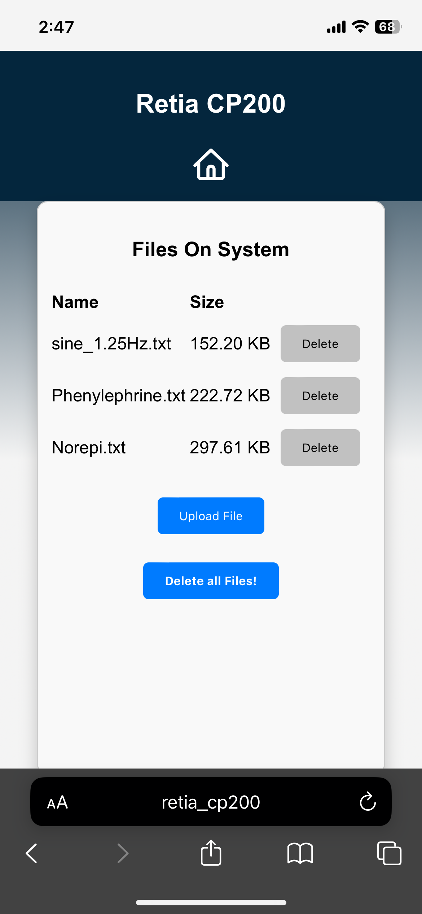
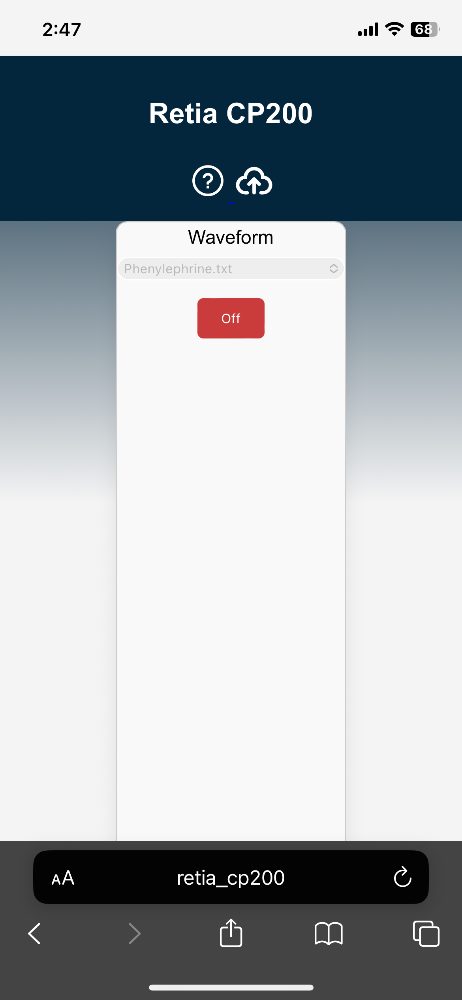

# ESP32 Local Webserver
## with SPIFFS Upload & MCP4725 Digital to Analog Transmission Routine

### Overview
This repository contains a web application for ESP32 that enables users to upload, delete, download, and format files. 
Additionally, it includes a routine to transmit data from a medical dataset uploaded on the SPIFFS using an MCP4725 DAC peripheral.

### Screenshots

### Structure
1. The final deployed application can be found under `V3/`.
2. Web application files (HTML/CSS/JS) are stored as a `.h` file under `include/`.
3. The webserver and DAC routine application are located in `src/`.
4. The maximum possible partition table for a 6MB ESP32 V2 is provided in `no_ota_2_2.csv`.
5. PlatformIO configuration files for `featheresp32` and `adafruit_feather_esp32_v2` are available in `platformio.ini`.

### Tips if forking for your project
1. There seems to be a limit to the amount of CSS that can be rendered at runtime when supplied using inline `<style>`. If your application requires elaborate CSS and/or frameworks, it's recommended to load the files onto SPIFFS and reference them in your HTML.
2. Since this project necessitated SPIFFS formatting capability, the HTML, CSS, and JS files are stored in app storage as header files. If this isn't an issue for your project, it's better to have separate `.html`, `.css`, and `.js` files in SPIFFS.
3. The app will be served at http://"<your hostanme>". By default -- retia_cp200. Refer V3/retia.ino for complete wifi config details.
4. The app also has an API through which you can access the app via serial. You can test it using Docklight etc.

#### Acknowledgement
Parts of the SPIFFS upload mechanism are based on this [repository](https://github.com/smford/esp32-asyncwebserver-fileupload-example).
